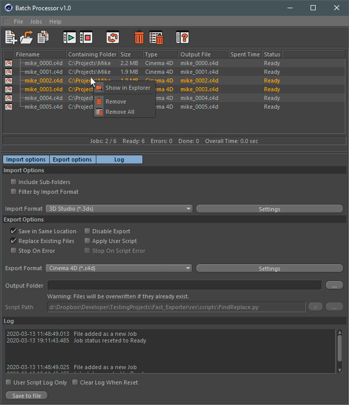

# Batch Processor

\*\*\*\*[**Batch Processor**](https://mikeudin.net/product/batch-processor-for-cinema4d/) is a plugin that allows you to batch process files of various 3D formats that are supported by **Cinema 4D**.

## Key features

* Batch import and export of files supported by **Cinema 4D** formats. 
* User-friendly interface.
* Background mode. Do not interrupt your work while the **Batch Processor** handles files. 
* Custom **User Scripts**. You can process documents in the **Batch Processor** queue with scripts supported by **Cinema 4D** Python API.

