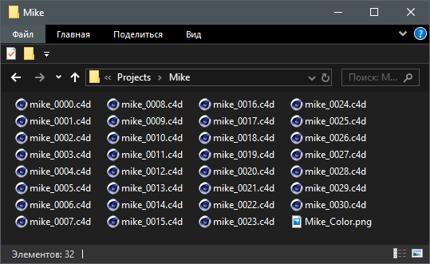

# Overview

To start working with the plugin, you have to add the processed files to the queue. This can be done using the **File menu** or panel buttons or by dragging and dropping files from _Windows Explorer_ or _MacOS Finder_.

### File menu

.png>)

**Add Current Project** command queues the active document. If it is not saved, user will be prompted to save the document. **Add File** queues user-selected file. **Add Folder** command queues all files from the user selected folder **Add Files From Clipboard** command queues all files from user-copied list of full file paths. **Export Jobs as Txt** - export information from the queue as text to file. **Save Preset** command saves the plug-in settings to disk. **Load Preset** - loads the plugin settings from the preset file.

### Jobs menu

**Start Processing** - start jobs processing in the queue. Carried out only jobs with status _Ready_. **Stop Processing** - stops the jobs processing. **Delete** - removes selected jobs from queue. **Clear All** - clears the jobs queue. **Reset Job Status** - resets the status of the selected jobs to _Ready._

### Help menu

**About** - contains information about the plugin and current version. **Online Help** - opens the plugin's help page in a web browser. **Feedback** - from here you can send an email to the developer with the suggestions or bugreport. **Manage License** - license activation/deactivation.&#x20;

### Plugin window

The button panel duplicates the functions of the plugin menu, providing them with faster access. The file queue window displays a complete list of processed jobs, as well as all the information necessary for this.

#### Import tab

**Include Sub-folders** - option to include the files of subfolders when importing with _Add Folder_ function. **Filter by Import Format** - an option restricting the type of imported files to the _Import Format_ field. \
**Import Format** - select a file format that you need and click the **Settings** button to configure its import settings in _Cinema 4D_ preferences.

#### Export tab

**Save in Same Location** - exported files will be saved in the source folder.\
**Replace Existing Files** - if files with the same name already exist in the destination directory, they will be overwritten. \
**Stop on Error** - stop queue processing when an error occurs.\
**Disable Export** - this option disables the file export and/or the user script will be applied without saving the changes. \
**Apply User Script** - an option that activates user script execution specified in the _Script Path_ field. \
**Stop On Script Error** - stop processing the queue when an error occurs on user script execution.\
**Export Format** - select a file format that you need and by clicking the Settings button you can configure the export settings on _Cinema 4D preferences_ dialog. \
**Output Folder** - distination path to save export results.

#### Log tab

**User Sript Log Only** - display only information that the user script displays when executing on a file in the queue.\
**Clear Log When Reset** - clear the file processing log when the status is reset using the _Reset status_ button or from the menu _Jobs > Reset Jobs Status._\
__**Save to File** - save the log display tab contents to a text file.

