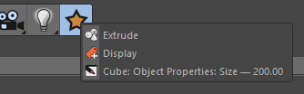
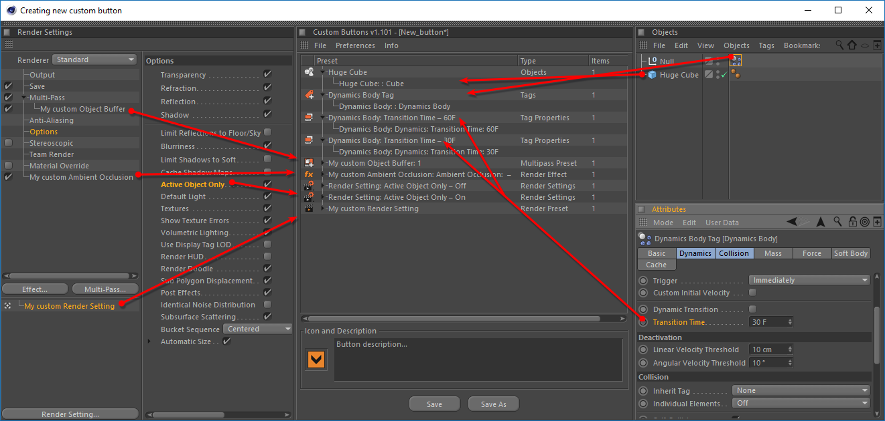

# Creating the preset

Each button can contain several presets.

**Custom Buttons** plug-in allows you to create presets with the following types: Properties of Objects, Tags, Materials, Layers, Render Settings parameters, Document parameters, Viewport parameters, Cinema 4D preferences. As well as presets of objects, tags, materials, layers, render settings \(separately multi-pass settings and render effects\).

Drag the selected object or parameter into the plug-in window.

After specifying all the data in the drop zone, a new group will appear with the object. Thus, you can add an unlimited number of groups, and groups can be filled with an unlimited number of objects or parameters.

