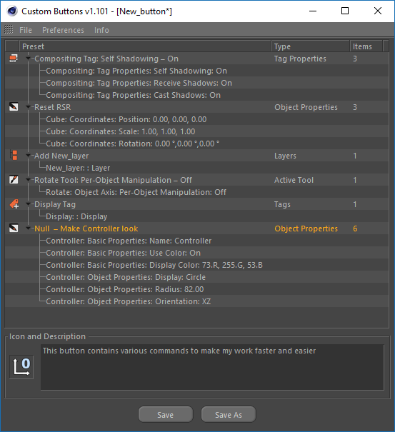
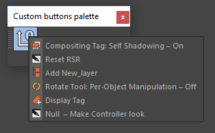

# Custom Buttons

**This plug-in is designed to create user python scripts assigned to certain actions:**

* Adding user objects, tags, materials, layers, render settings and etc.
* Applying saved parameters  to document, objects, tags, materials, layers, view and render settings.

Custom Buttons webpage \(weblink\)

