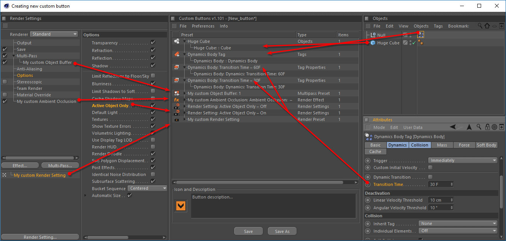

# Creating the preset

Each button can contain several presets.

**Custom Buttons** plug-in allows you to create presets with the following types: Properties of Objects, Tags, Materials, Layers, Render Settings parameters, Document parameters, Viewport parameters, Cinema 4D preferences. As well as presets of objects, tags, materials, layers, render settings \(separately multi-pass settings and render effects\).

Drag the selected object or parameter into the plug-in window.

If you want to create a new preset based on dropped object or parameter just drop it on to empty space of the window. If you want add object or parameter to existing preset, drop it under preset header, to add to a list objects or parameters.

By default after dropping object or parameter on to the preset list window new preset appears with a name that describes shortly its properties. To change default preset name you can open plug-in window menu **Edit &gt;** **Preferences.**

Now you can define new default preset name using this tokens:

**$obj** — as object name, **$group** — parameter group name, **$param** — parameter name, **$value** — parameter value. ****


#### Impotant note. Creating object, material, tag, render settings preset.

Make sure all objects which you want save as preset are still in the scene before your button will be saved! If you try to delete the object, _entry will disappear from the preset list._ 


After specifying all the data in the drop zone, a new group will appear with the object. Thus, you can add an unlimited number of groups, and groups can be filled with an unlimited number of objects or parameters.

