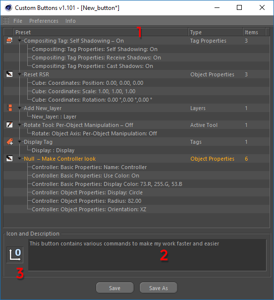

# How it works

Go to the menu **Plug-ins &gt; Custom Buttons**. In the window that opens, you will see the main elements intended to create your first user preset.

Drop Zone **\(1\)** is designed for dragging and dropping objects or parameters there.

In the text box **\(2\)**, you can leave a button description or any other comments.

Field **\(3\)** is intended to create an image file, which will be saved with the script as an icon.

