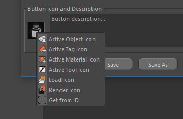

# Icon and description

Now assign an icon image to the button.

**Custom Buttons** plug-in offers several options for creating icons for the button. You can use the icon of the active object, tag, material or active tool. You can also load an image from the disk, render the scene, and also choose the icon of a Cinema 4D command.

To capture the icon of the active object, tag or material, select the desired object in the manager, then in the plug-in window, click the icon and open a pop-up menu.

If necessary, you can specify a description of the button. In addition to the description specified by the user, will be added information about all the parameters contained in the presets.

