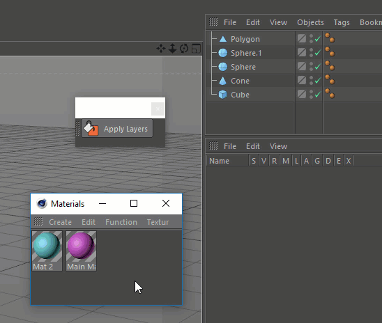

# Utilizing button

Open the Cinema 4D menu **Window &gt; Customization &gt; Customize Commands...**. Use **Name filter** to find your script. Drag the button to the toolbar and close **Customize Commands...**. window.   
If the button contains only one preset, the program will execute it, but if there are more presets, an additional pop-up menu will appear.

When you press a button using the keyboard shortcut **Ctrl+Alt+Shift**, the presets will be activated cyclically one after another without a pop-up menu.


By pressing **Alt** button applying layer preset you can choose between selected objects, tags, materials. 



By pressing **Alt** button applying material preset you can apply it to selected objects.


To get access to the description of the button, you need to click on it with **Alt+Shift** hotkey pressed.

