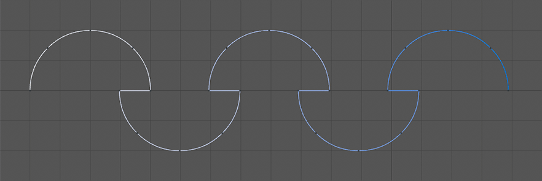

# Fast Spline Connector

As you know, built-in functions **Cinema 4D** does not allow to connect a segments of a single spline.   
But now you can do it with this a little but very useful plug-in! Pretty fast, pretty easy!

[Fast Spline Connector webpage](http://mikeudin.net/product/fast-spline-connector/)  

