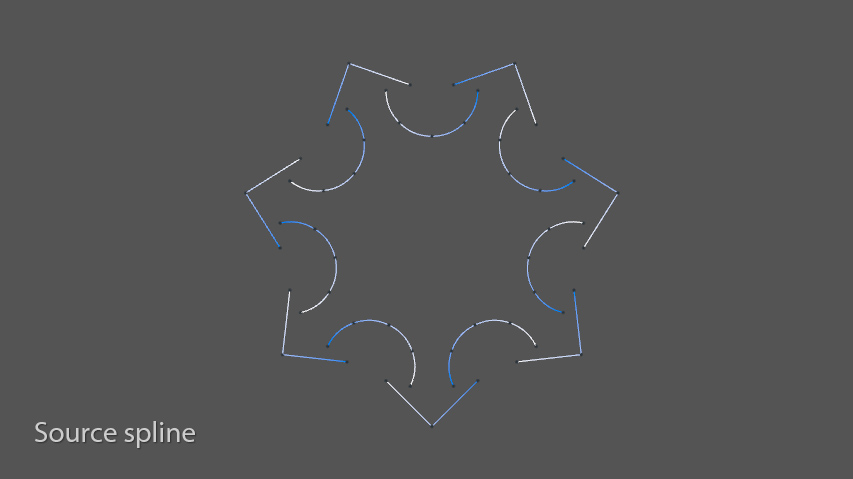
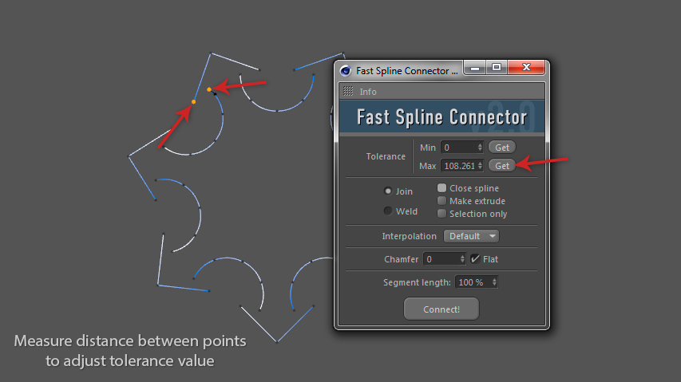
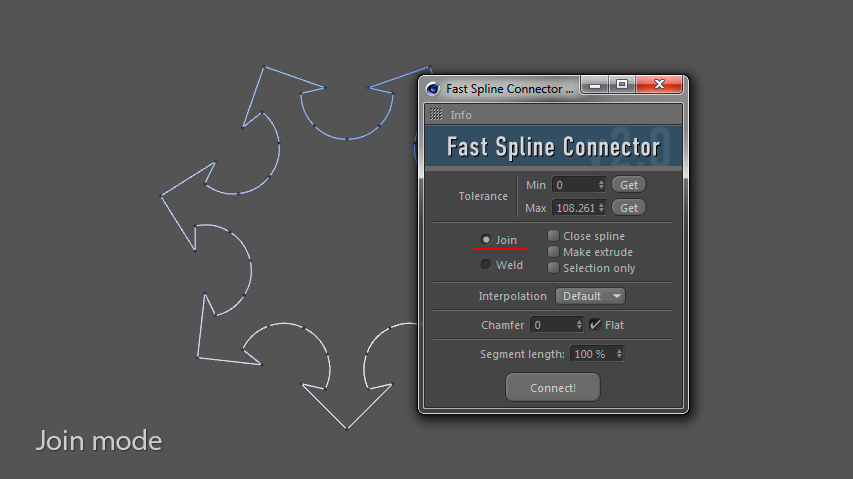
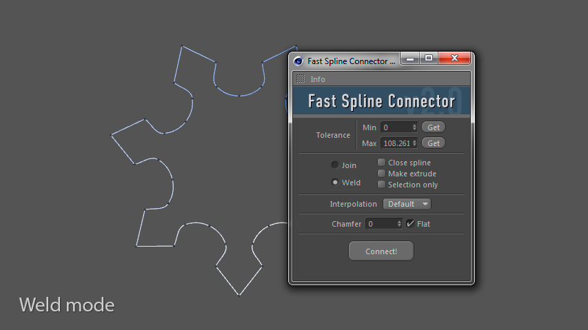
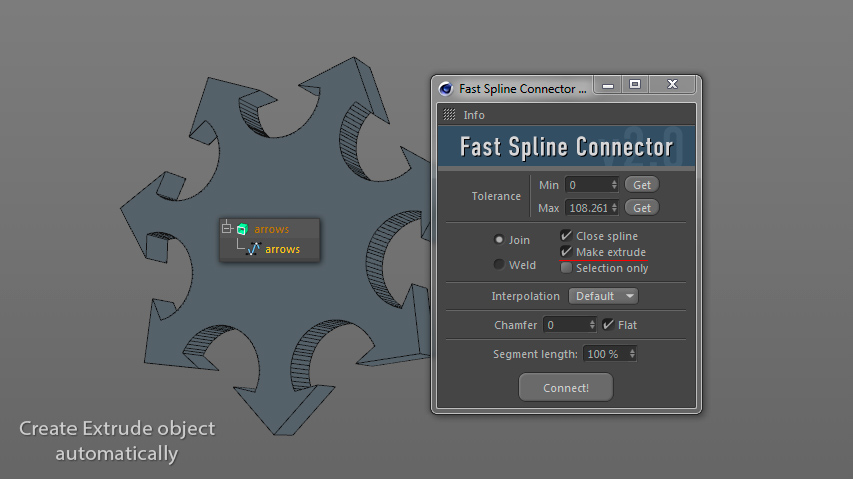
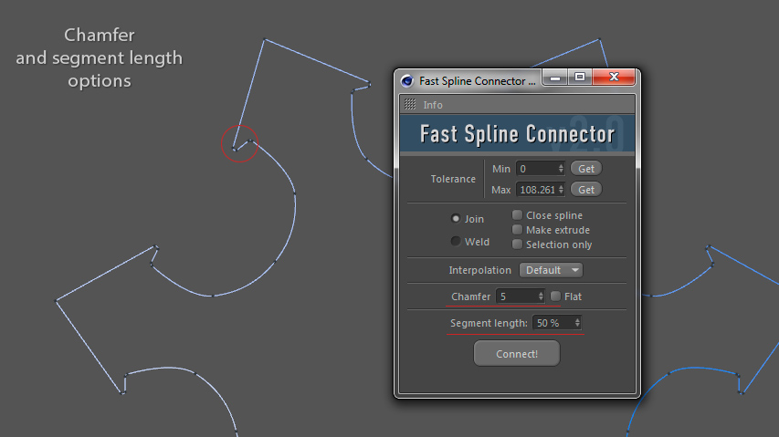
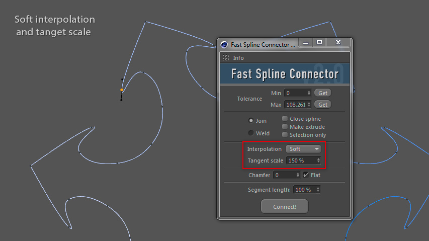

# Overview

#### Start with any un-joined spline

#### Use the "Get" button to automatically set the correct distance tolerance

#### The Join mode creates a new segment between connected points.

#### The Weld mode weld two spline points into a single point.

#### Automatic extrude option

#### Customize interpolation, chamfer and segment length options for connected points

