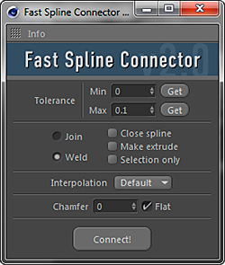

# Version history

### v2.0

1. Dramatically increased speed and stability. Mainly with splines with many segments.
2. NEW: To find points more accurately, tolerance parameter can now be adjusted with minimum and maximum values.
3. NEW: "Selection only" mode to connect selected points.
4. NEW: Now you can apply hard or soft interpolation for newly created points. Tangent scale option for soft interpolation.
5. NEW: Chamfer effect for newly created points.

### v1.0

Initial release

