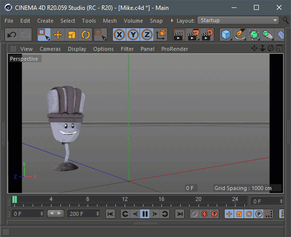

# File Sequence Exporter

[File Sequence Exporter](https://mikeudin.net/product/file-sequence-exporter/) is a plug-in for **Cinema 4D** that allows you to export each frame of animated scene to a separate **c4d** or **obj** file. The file sequence obtained in this way can be used for import in the form of animated geometry into various graphic packages. For example, in **Adobe After Effects** with the **Element 3D** plug-in.

