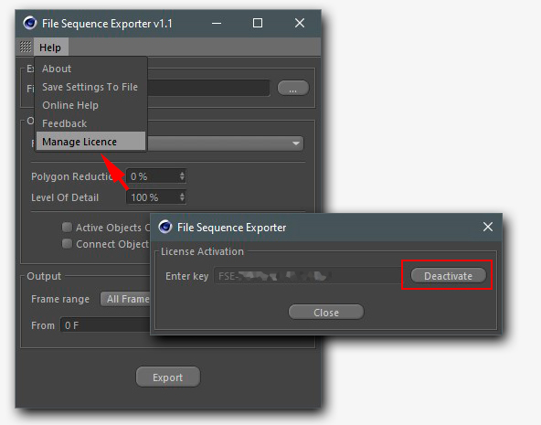

# Manage License

Each license code have a limits of activations on Cinema 4D Installations. If you purchased one machine  license code you can use it on another installation only after deactivation on previous Cinema4D installation. 

