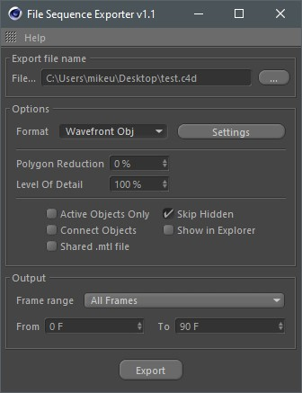

# Overview

1. Specify the path to save the file sequence.
2. Select a file saving format.
3. Adjusting **Polygon Reduction** option you can set the percentage of geometry optimization. Keep in mind that using this feature increases the total processing time. 
4. Using primitives and nurbs-objects in the scene, you can adjust the **Level Of Detail** _****_of the resulting geometry. 
5. Options: **Active Objects Only** - export only selected objects; **Skip Hidden** - objects hidden from the rendering will be skipped. **Shared .mtl file** - If the materials are not changing between animation frames, then there's no need to write out a .mtl file for each frame. If you enable this option, a common .mtl file is written. **Connect Objects** - all meshes will be connected into a single object. **Show in Explorer/Finder** - show results in Windows Explorer or Finder MacOs.
6. Specify the frame range to save.

