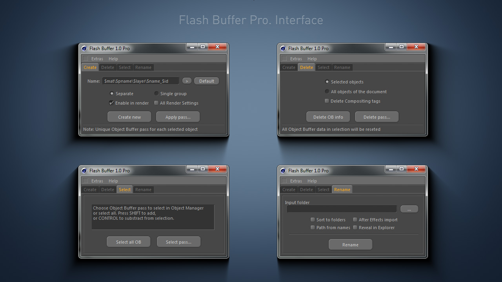

# Flash Buffer



**Flash Buffer for Cinema 4D** is a plugin that helps you to create _Object Buffer_ passes when you need to prepare scene for rendering. With this plugin you can also quickly and easily assign the available passes, delete unnecessary or select objects to which it are assigned. **Rename** function will help specify the names of the results of rendering passes, as well as convenient to distribute all the sequences on the subdirectories.

[Flash Buffer w](http://mikeudin.net/product/flash-buffer/)[ebpage](http://mikeudin.net/product/flash-buffer/)

