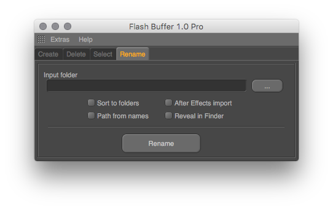

# Overview

On this tab, the user can create OB passes using the two methods **Separate** and **Single group**. In the **Separate Mode**, individual passes for all objects selected in the OM will be created, in the **Single Group mode** all selected objects will be placed on one common pass.

**Enable in render** activites created pass in the render settings.   
**All Render Settings** checkbox indicates the creation of passes for all available rendering settings.

The **Apply pass** button applies existing OB passes to the selected objects.

On this tab, you can delete OB passes for all selected objects \(**Selected objects option**\), as well as for all objects in the document \(**All objects of the document option**\). The **Delete Compositing tags** option means that all Compositing tags will be deleted if their other settings are not activated.  
The **Delete pass** button deletes the passes that are available in the scene or for selected in Object Manager objects.

On this tab, you can select objects according to the Compositing tags applied to them. Objects can be added to the selection \(**Shift** key\) or excluded from it \(**Control** key\).

**Rename** function allows to sort sequence files to separate subfolders. This processing not only OB passes files, but also the other passes from the specified directory. It should be noted that the **Rename** function works in a _separate thread_. This means that when processing large numbers of files, Cinema 4D won’t hang, waiting for the end command, and you can use the program further.

**Path from names** option indicate, that now all slashes \(«/» or «\»\) in the passes names is the dividers to create a new path. Organizing OB files becomes easier!

There’s a script for **Adobe After Effects** included to plug-in, that helps to import the sequence of files after the renaming . The main advantage of this method is supporting Unicode characters in file paths, witch is usually a problem when you import via \* .aec file and all subdirectories structure built using the **Path from names** functions will also be reflected in After Effects project.

