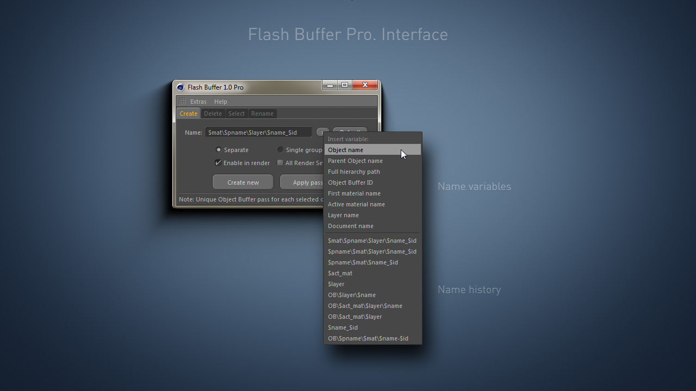

# Rename function

Using the **Name** field you can specify the name of the new OB passes which will be entered into the settings of the multi-pass channel.   
Using special variables you can add certain information to the name.   
Variable **$name** corresponds to the name of the object for which the pass is being created \(**Separates mode**\). The variable **$id** - substitutes the ID of the pass, **$doc** - the name of the document without the extension, **$mat** - the name of the first material assigned to the object and etc.   
It is not necessary to memorize variables, just press the arrow button and select the item of interest from the dropdown menu.   
If you leave the **Name** field empty, then the passes will be created with the standard name **Object Buffer**. The **Default** button returns the value in the **Name** field to the original one.

