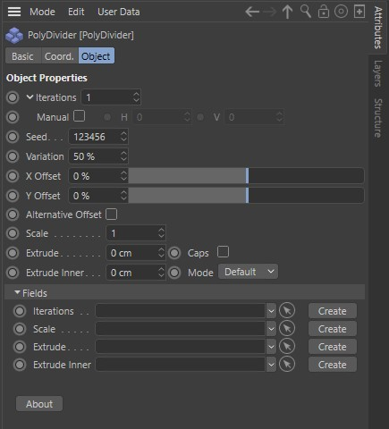
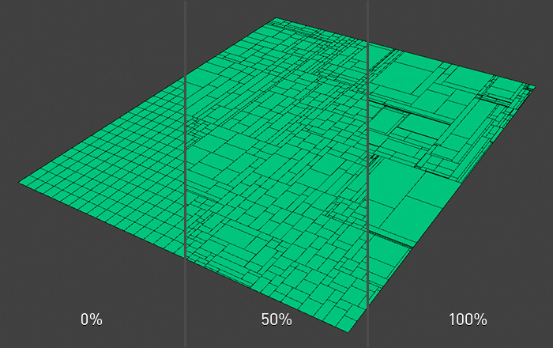
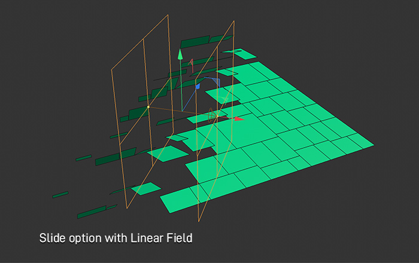
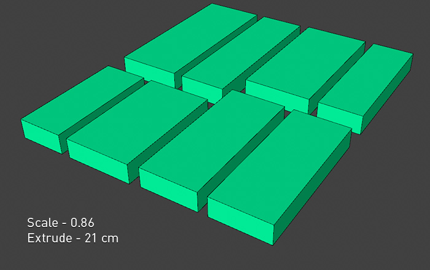
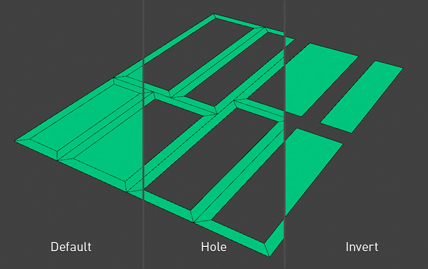
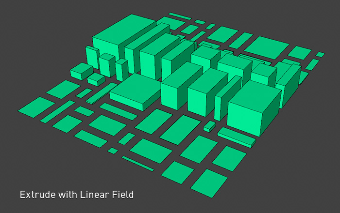
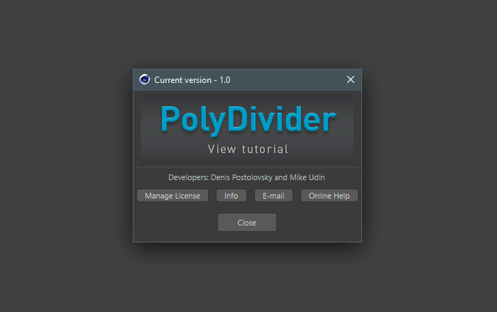

# Overview

**PolyDivider** is a **Cinema 4D** deformer plugin that makes procedural subdividions on polygon meshes or primitives allowing the user to create rectangular style topology.

### Usage

**PolyDivider** creates in a Cinema 4D scene a new _deformer_ object. To know how to use deformers please take a look [this article](https://help.maxon.net/us/index.html#5460).&#x20;

### Options

#### Iterations 

Each polygon of a deformable object is recursively divided into two new polygons according to the number of iterations.

#### Manual 

This setting can be opened by clicking on the small triangle to the left of the **Iteration** option. Here you can specify the number of polygons iterations separately for vertical and horizontal splitting

#### Seed 

Changing the **Seed** value will result in entirely different random iterations result.

#### Variation 

Varies the size proportions of the newly created polygons.&#x20;

* **0%** - Polygons size the same.&#x20;
* **100%** - Polygons size different.

#### X Offset, Y Offset 

Change polygons size by moving on perpendicular directions of the source polygon plane

#### Alternative Offset 

Makes offset function more variable

#### Scale 

Polygons scaling

#### Slide 

With the **Slide** option, polygon edges can be moved  along their surface. It works like **Scale** option but from particilar edge. Polygon sliding can be managed using Fields with it direction and strength.&#x20;

#### Angle 

Polygon sliding can be done with rotation movement. This option indicates start angle when polygon starts sliding. **Spline** feature helps to adjust animation for more convinient result.&#x20;

#### Extrude 

This option extrudes polygons like a [Cinema 4D Extrude Tool ](https://help.maxon.net/us/index.html#TOOLEXTRUDE)

#### Caps 

Enable this option to create a cap at the base of the extrusion. This gives you a quick way to create a closed volume.

#### Extrude Inner 

This option operates in a similar way to _Extrude_ but the polygons are extruded inwards.

#### Mode 

_Extrude Inner_ option modes:&#x20;

* **Default** - Standart mode&#x20;
* **Hole** - Only extruded polygons&#x20;
* **Invert** - Without extruded polygons

#### Field Precision 

This option setting up polygon sensibility to fields&#x20;

#### Optimize Tolerance 

After each iteration plugin optimizes geometry. To eliminating points you may enter a tolerance value. If points are closer to each other than this value, then they are merged into one point; if the points are further apart than the value, they will not be merged. If polygons become redundant (e.g., if all three corner points of the polygon occupy the same point), CINEMA 4D will automatically delete them.

#### Fields

_Iterations, Scale, Extrude, Extrude Inner_ and Slide parameters can be changed using the [**Cinema 4D Fields System**](https://www.youtube.com/watch?v=Vzt4midvx30). Create a Field object, drag it to the Linkbox of the parameter you need, or click the **Create** button to add a new Group Field. Read more about how **Cinema 4D Fields System** works [here](https://help.maxon.net/us/index.html#58091). See examples in the **Videotutorials** section.

#### About

In this dialog box, you can activate/deactivate the plugin, open **Online Help** page or the plugin's official page and send feedback message by email.

