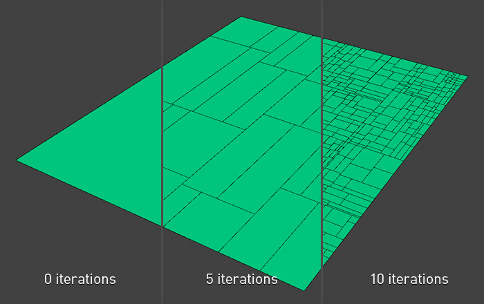

# Overview

**PolyDivider** is a **Cinema 4D** deformer plugin that makes procedural subdividions on polygon meshes or primitives allowing the user to create rectangular style topology.

### Usage

**PolyDivider** creates in a Cinema 4D scene a new _deformer_ object. To know how to use deformers please take a look [this article](https://help.maxon.net/us/index.html#5460). 

### Options

#### Iterations 

Each polygon of a deformable object is recursively divided into two new polygons according to the number of iterations.

#### Manual 

This setting can be opened by clicking on the small triangle to the left of the **Iteration** option. Here you can specify the number of polygons iterations separately for vertical and horizontal splitting

#### Seed 

Changing the **Seed** value will result in entirely different random iterations result.

#### Variation 

Varies the size proportions of the newly created polygons. 

* **0%** - Polygons size the same. 
* **100%** - Polygons size different.

#### X Offset, Y Offset 

Change polygons size by moving on perpendicular directions of the source polygon plane

#### Alternative Offset 

Makes offset function more variable

#### Scale 

Polygons scaling

#### Extrude 

This option extrudes polygons like a [Cinema 4D Extrude Tool ](https://help.maxon.net/us/index.html#TOOLEXTRUDE)

#### Caps 

Enable this option to create a cap at the base of the extrusion. This gives you a quick way to create a closed volume.

#### Extrude Inner 

This option operates in a similar way to _Extrude_ but the polygons are extruded inwards.

#### Mode 

_Extrude Inner_ option modes: 

* **Default** - Standart mode 
* **Hole** - Only extruded polygons 
* **Invert** - Without extruded polygons

#### Fields

_Iterations, Scale, Extrude, Extrude Inner_ parameters can be changed using the [**Cinema 4D Fields System**](https://www.youtube.com/watch?v=Vzt4midvx30). Create a Field object, drag it to the Linkbox of the parameter you need, or click the **Create** button to add a new Group Field. Read more about how **Cinema 4D Fields System** works [here](https://help.maxon.net/us/index.html#58091). See examples in the **Videotutorials** section.

#### About

In this dialog box, you can activate/deactivate the plugin, open **Online Help** page or the plugin's official page and send feedback message by email.

