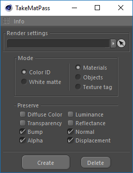
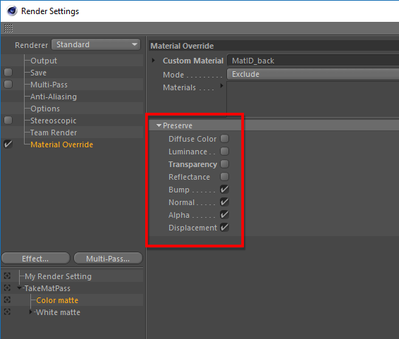

# Overview

### Render settings

Drop to this field the final render settings of the scene, based on them the plug-in will create Takes.

### Mode: Color ID

For all selected materials, objects and texture tags, **TakeMatPass** creates Take with the name "MaterialID", in which each material is painted in a separate unique color. Thus, after displaying this state of the scene, you can get ONE pass containing the colored masks of the materials.  
 To set the same color for the selected objects/materials/tags hold SHIFT and press the **Create** button.

### Mode: White matte

For each selected material,object or texture tag, **TakeMatPass** creates a separate Take, that is, the scene state at which the specified material is displayed with a white mask, and everything else, through the Material Override function, is black.

### Preserve

This options group reflects the same parameters of Material Override settings.

_If not all material properties should be replaced and only specific channels should be excluded or Displacement enable the corresponding option here. These channels will then be assumed by the original material. Note that the Diffuse Color option includes the Color AND Diffuse channels!_   
 Check out more info about this Cinema 4D feature [here](https://help.maxon.net/us/#DRENDERSETTINGS-RDATA_GROUP_OVERRIDEMAT).

