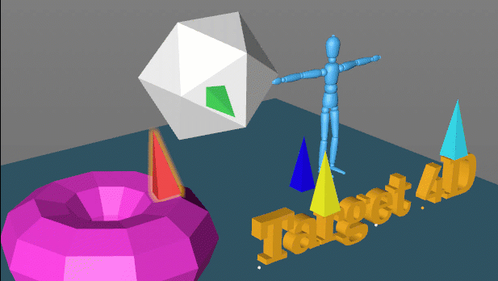

# Target 4D

**Target 4d** is a Cinema 4D R17 and higher plug-in designed to move and/or copy selected objects onto the geometry surface of other scene objects. This tool is absolutely suitable for interior and exterior architectural use and will save you a lot of time:

* Place or copy objects on any surface.
* Quickly switch between active objects using hot keys.
* Use advanced copy modes: random, along the line, on the grid.
* Interactive interface for quickly changing the brush size and grid shape.
* Use Bounding Box option to detect the dimensions of the object geometry and place it correctly.
* Snapping. Quickly place objects to the center of the polygon, faces or vertices.
* Flexible settings help you cope with various situations: inversion of normals, selected polygons, etc.

[Target 4D webpage](http://mikeudin.net/product/target-4d/)  

