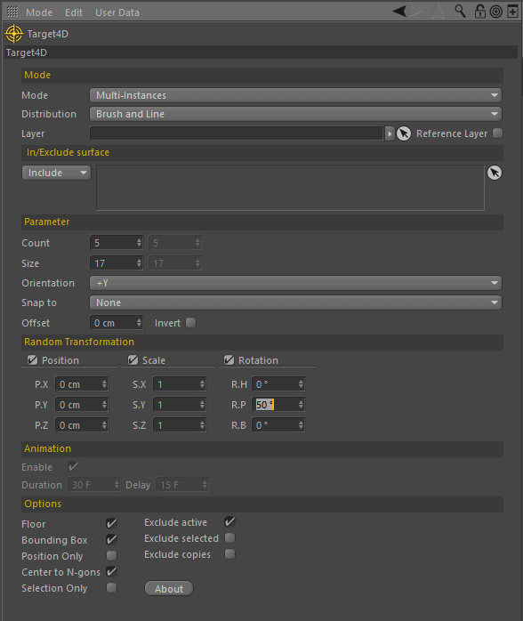
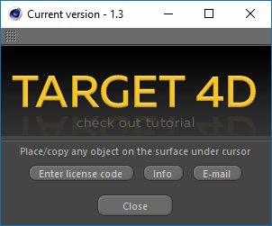
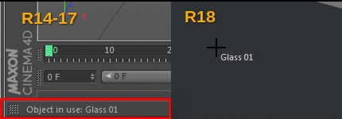

# How it works

**Target 4D** is a Cinema 4D tool plug-in. You can find it in application menu **Plugins &gt; Target 4D**.

Select any object in **Object Manager** and pick up target surface in the scene.   
Use **Target 4D Tool Settings** to adjust options.   

Press **About** button to find more information about plug-in registration and tutorials.

### Version differences

Due to the Cinema 4D Python API limitations there is a little difference of the display information about selected objects. Using Cinema 4D R18 und higher you'll see selected objects info under cursor, using earlear versions in status bar.

