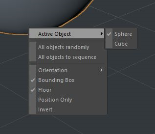
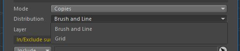
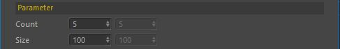
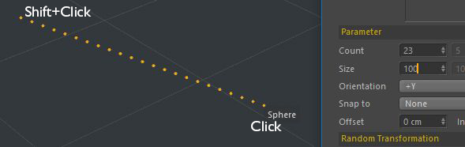
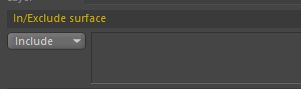
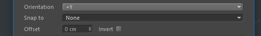
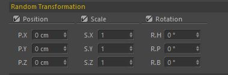
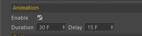
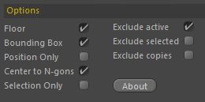

# Overview

Five modes of operation are available.  
_Transfer_ mode is used to move objects; _Copies, Instances, Render Instances, Multi-Instances_ for creating copies and instances.

To move an object to the surface of the geometry, you need to make it active in the **Object Manager**, activate the plugin from the **Plugins &gt; Target 4D** menu, then click in the viewport. The active object will move to the selected point. You can also work with several selected objects. To do this, activate the context menu in the viewport by pressing **Esc**.  

**Active Object** menu indicates which of the selected objects will be moved \(or copied\) by the plug-in.  
**All objects randomly** sets the random mode of moving/copying objects.  
**All objects to sequence** sets the sequential mode of moving/copying objects.

Modes _Copies, Instances, Render Instances, Multi-Instances_ work in the same way, the difference is in the type of copies that are created as a result. When this mode is activated, the **Distribution** option becomes available.

#### Distribution mode: Brush

This option defines the shape of the copy tool as a brush. By moving the brush across the screen, the user indicates the areas where copies will be placed.  

The **Count** parameter determines the total number of clones that will be created.  
The **Size** parameter defines the size of the brush. If you set the brush size to **1**, then all copies will be distributed along one line or at one point, if the you made just one click.  

#### Distribution mode: Line

Press **Shift and click** the left mouse button, a line of points equal to the number specified by the **Count** parameter will appear. Release **Shift** button and second click will create a straight line of copies.

#### In/Exclude surface

Available for **Cinema 4D R18** and above. In this field you can put objects which surface will or will not be taken.

**Orientation** option sets the object axis that will be directed perpendicular to the surface.  
**Auto \(-Y, + Y, -Z\)** orientation mode can be useful for automatically detecting horizontal and vertical surfaces like a floor or ceiling.  
**Snap** parameter will help to place objects regarding the center of polygons, faces or vertices.  
**Offset** option sets the up/down offset relative to the surface.  
When the **Invert** option is on, the object will be placed on the back side of the surface.

#### Random Transformation

This option allows you to randomly change the properties of copies: position, scale and rotation.  
**Attention!** The transformation axis is located on the surface of the polygon where object will placed.  

#### Animation

Using **Transfer mode**, you can add _animation_ for the object being moved.  
**Duration** sets the duration of the animation in frames, the **Delay** parameter - the delay time between movements.

#### Additional options

**Floor** - consider Floor objects when determining the surface.  
**Bounding Box** - place the object on the surface relative to its dimensions \(depending on the selected axis\)  
**Position Only** - do not rotate the object, just move it.  
**Center to N-gons** - when positioning, using the **Snap** function, use the N-gon center.  
**Selection Only** - move and copy objects only in the zone of selected polygons.  
**Exlude active** - ignore the surface of the active object.  
**Exclude selected** - ignore the surface of all selected objects.  
**Exclude copies** - ignore the surface of the copies created by **Target 4D** plug-in.

