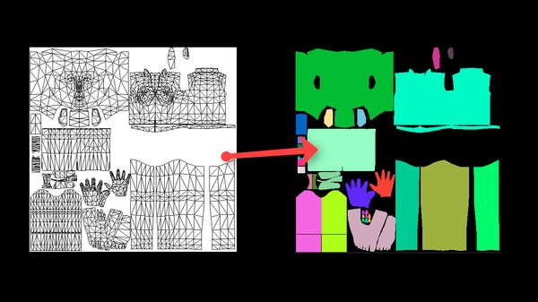

# UV Colorizer

**Cinema 4D R14 and higher** Python script helps to create Color IDs for UV islands. Color ID maps are extremely useful to work with areas of different materials in Substance Painter.

[UV colorizer webpage](http://mikeudin.net/product/uv_colorizer/)

