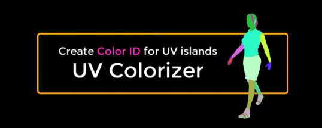
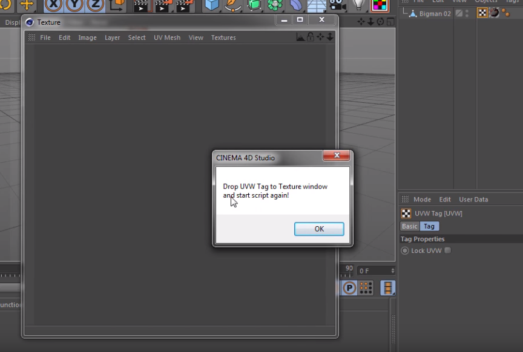
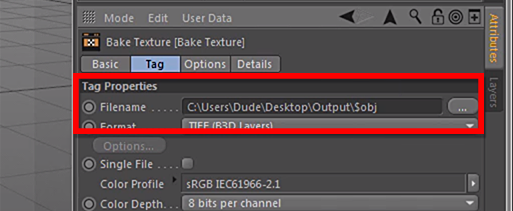

# Overview

**UV Colorizer** script do not have an user interface. All you have to do it's just a launch the script from scripts menu.

Script creates a color mask for UV by creating a separate materials for each UV island painted in its own unique color. Then the texture of the model, using the Bake Texture tag, bakes to image with the desired parameters.\

### How it works

1.  Select the UVW tag  and run the script. An empty Texture window will open. Drag  tag into the Texture window and close it. \
    &#x20;&#x20;

    
2. Run the script again.
3. The 3D model will be painted in different colors according to the UV islands, after that  the color mask rendering process will be launched.
4. Now you can save the resulting image to disk.
5.  Parameters of the Bake Texture tag can be saved and script will use it on each new launch.\
    &#x20;

    
6. Use the _$obj_ token to substitute object name in the Filename field. Now, after rendering the image, script will save it to a file with name of the object.
7. Select the Bake Texture tag and run the script.
8. To remove tags and materials created by the script, select the object and run the script with the **Shift** key pressed.
