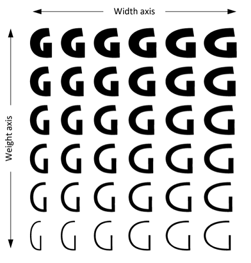

# 🆕 VariText

## Overview

Variable fonts have revolutionized the world of typography by introducing a flexible and dynamic approach to font design. With their adjustable attributes or axes, these fonts offer numerous advantages for designers and developers.

<figure><figcaption></figcaption></figure>

Unlike traditional fonts with fixed styles, variable fonts allow for seamless adjustments along various axes, such as weight, width, and slant. This versatility enables designers to create custom font variations tailored to specific design needs, providing greater creative freedom.

<figure><figcaption>
Variable Fonts: What They Are
</figcaption></figure>

With variable fonts, multiple font styles can be consolidated into a single file, reducing the file size and enhancing performance. This efficiency is particularly advantageous for web design, where optimizing page loading times is crucial.

The flexibility of variable fonts extends to animations and interactivity. Designers can animate font attributes smoothly, allowing for engaging and dynamic typography effects. This adds a layer of visual interest and enhances user experience in interactive applications.

With [VariText](https://mikeudin.net/product/varitext-for-cinema-4d/), you can now harness the full potential of variable fonts within Cinema 4D. Seamlessly integrate this cutting-edge technology into your projects and unlock a world of possibilities.



## Quick links


[installation.md](installation.md)



[version-history.md](version-history.md)



[settings.md](settings.md)



[user-interface.md](user-interface.md)



[videotutorials.md](videotutorials.md)

